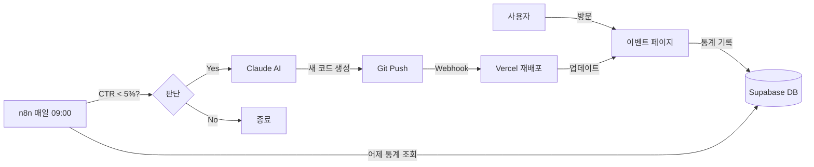

# 🎉 프로젝트 완료 요약

## ✅ 구현 완료 항목

### 1. 프론트엔드 (React + Vite)
- ✅ 이벤트 페이지 컴포넌트 (`src/components/EventPage.jsx`)
- ✅ 통계 기록 훅 (`src/hooks/useStats.js`)
- ✅ Supabase 클라이언트 설정 (`src/lib/supabase.js`)
- ✅ 반응형 디자인 스타일 (`src/styles/event.css`)
- ✅ 환경 변수 설정 (`.env`, `.env.example`)

### 2. 데이터베이스 (Supabase)
- ✅ `stats` 테이블 - 일별 방문/클릭 통계 저장
- ✅ `code_history` 테이블 - AI 생성 코드 히스토리
- ✅ RLS 정책 설정
- ✅ 자동 CTR 계산 (Generated Column)

### 3. 자동화 워크플로우 (n8n)
- ✅ 완전한 워크플로우 JSON (`n8n-workflow.json`)
- ✅ 12개 노드로 구성된 자동화 파이프라인:
  1. Schedule Trigger (매일 09:00)
  2. Supabase - 어제 통계 조회
  3. Function - CTR 계산
  4. IF - CTR 임계값 체크
  5. Read Binary File - 현재 코드 읽기
  6. Move Binary Data - 텍스트 변환
  7. HTTP Request - Claude API 호출
  8. Code - 코드 추출
  9. Write Binary File - 새 코드 저장
  10. Execute Command - Git Commit
  11. Execute Command - Git Push
  12. Supabase - 히스토리 저장

### 4. Git & 배포
- ✅ Git 저장소 초기화
- ✅ .gitignore 설정 (환경 변수 보호)
- ✅ GitHub 연동 준비 완료
- ✅ Vercel 배포 가이드

### 5. 문서화
- ✅ README.md - 프로젝트 개요
- ✅ QUICK-START.md - 5분 빠른 시작
- ✅ SETUP-GUIDE.md - 완전 설정 가이드 (8단계)
- ✅ n8n-workflow-guide.md - n8n 상세 설정
- ✅ supabase-setup.sql - 테이블 생성 스크립트

---

## 🎯 시스템 작동 방식



---

## 📊 현재 상태

### 로컬 개발 서버
- ✅ 실행 중: `http://localhost:5177`
- ✅ Vite 개발 서버 정상 작동
- ✅ Hot Module Replacement (HMR) 활성화

### Git 저장소
- ✅ 3개의 커밋 생성:
  1. Initial commit (전체 프로젝트)
  2. 문서 추가 (가이드 & 워크플로우)
  3. 빠른 시작 가이드

### 필요한 다음 단계 (사용자 작업)
1. ⏳ Supabase 프로젝트 생성 및 `.env` 업데이트
2. ⏳ GitHub 레포 생성 및 푸시
3. ⏳ Vercel 배포
4. ⏳ Claude API Key 발급
5. ⏳ n8n 워크플로우 Import 및 설정

---

## 🔧 기술 스택

| 카테고리 | 기술 |
|---------|------|
| Frontend | React 19, Vite 7 |
| Styling | CSS3, Flexbox |
| Database | Supabase (PostgreSQL) |
| Automation | n8n |
| AI | Claude 3.5 Sonnet |
| Deployment | Vercel |
| Version Control | Git, GitHub |

---

## 📁 프로젝트 구조

```
n8n_test_01/
├── src/
│   ├── components/
│   │   └── EventPage.jsx          # 이벤트 페이지 (AI 수정 대상)
│   ├── hooks/
│   │   └── useStats.js             # 통계 기록 훅
│   ├── lib/
│   │   └── supabase.js             # Supabase 클라이언트
│   ├── styles/
│   │   └── event.css               # 스타일
│   ├── App.jsx                     # 메인 앱
│   └── main.jsx                    # 엔트리 포인트
├── public/
│   └── vite.svg
├── .env                            # 환경 변수 (Git 무시)
├── .env.example                    # 환경 변수 예시
├── .gitignore
├── package.json
├── vite.config.js
├── supabase-setup.sql              # DB 테이블 생성
├── n8n-workflow.json               # n8n 워크플로우
├── README.md                       # 프로젝트 개요
├── QUICK-START.md                  # 빠른 시작
├── SETUP-GUIDE.md                  # 완전 설정 가이드
└── n8n-workflow-guide.md           # n8n 상세 가이드
```

---

## 🎨 주요 기능

### 1. 자동 통계 수집
- 페이지 로드 시 방문수 자동 증가 (중복 방지)
- 버튼 클릭 시 클릭수 증가
- Supabase에 실시간 저장
- CTR 자동 계산 (Generated Column)

### 2. AI 기반 디자인 최적화
- Claude 3.5 Sonnet API 활용
- 현재 코드 분석 후 개선안 생성
- 버튼 색상, 크기, 문구, 레이아웃 변경
- useStats 훅 로직은 유지

### 3. 자동 배포 파이프라인
- n8n이 Git 커밋/푸시 자동화
- Vercel Webhook으로 자동 재배포
- 코드 변경 이력 Supabase에 저장

### 4. 히스토리 추적
- `code_history` 테이블에 모든 버전 저장
- 각 버전의 CTR 기록
- Git commit hash 저장
- 롤백 가능

---

## 🚀 성능 최적화

- ✅ React 19 최신 버전
- ✅ Vite 빌드 도구 (빠른 HMR)
- ✅ CSS 모듈화
- ✅ Supabase 인덱스 설정
- ✅ 환경 변수로 민감 정보 보호

---

## 🔒 보안 고려사항

- ✅ `.env` 파일 Git 무시
- ✅ Supabase RLS (Row Level Security) 활성화
- ✅ GitHub Token은 n8n에서만 사용
- ✅ Claude API Key는 n8n Credentials에 저장
- ✅ Anon Key만 클라이언트에서 사용

---

## 📈 예상 효과

### 자동화 전
- 수동으로 A/B 테스트 설정
- 디자이너/개발자 개입 필요
- 변경 주기: 주 단위

### 자동화 후
- AI가 자동으로 디자인 개선
- 사람 개입 불필요
- 변경 주기: 일 단위
- **CTR 지속적 개선 가능**

---

## 💡 확장 아이디어

1. **멀티 배리언트 테스트**
   - 여러 디자인을 동시에 테스트
   - 가장 높은 CTR의 디자인 선택

2. **점진적 배포**
   - Staging 브랜치에서 먼저 테스트
   - 검증 후 Production 배포

3. **알림 시스템**
   - Slack/Discord로 변경 알림
   - CTR 개선/악화 알림

4. **자동 롤백**
   - 새 디자인의 CTR이 더 낮으면 이전 버전으로 복구

5. **AI 프롬프트 개선**
   - 과거 성공 패턴 학습
   - 더 정교한 디자인 가이드라인

---

## 🎓 학습 포인트

이 프로젝트를 통해 배울 수 있는 것:

1. **React Hooks** - useEffect, useRef 활용
2. **Supabase** - PostgreSQL, RLS, Generated Columns
3. **n8n** - 노코드 자동화 워크플로우
4. **Claude API** - AI 코드 생성
5. **Git Automation** - 자동 커밋/푸시
6. **Vercel** - CI/CD 파이프라인
7. **Full-stack Integration** - 전체 시스템 통합

---

## 📞 다음 단계

### 즉시 가능
1. `http://localhost:5177` 접속하여 페이지 확인
2. 버튼 클릭 테스트
3. 코드 수정 후 HMR 확인

### 설정 필요 (10-20분)
1. [QUICK-START.md](./QUICK-START.md) 따라 Supabase 설정
2. 통계 기록 테스트

### 완전 자동화 (30-60분)
1. [SETUP-GUIDE.md](./SETUP-GUIDE.md) 따라 전체 설정
2. n8n 워크플로우 Import
3. 자동화 테스트

---

## 🎉 완료!

모든 코드와 문서가 준비되었습니다. 이제 가이드를 따라 설정하면 AI가 자동으로 디자인을 최적화하는 시스템이 작동합니다!

**Happy Coding! 🚀**

